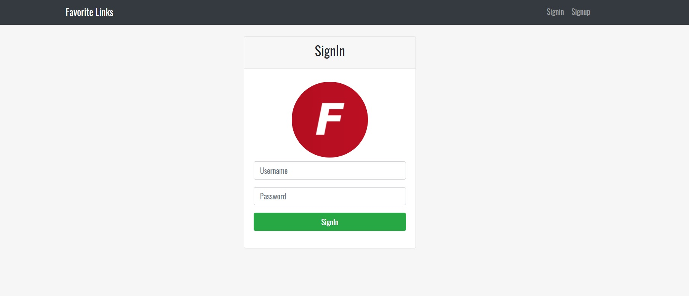

# nodejs-mysql-app

App with NodeJS and MySQL

## Dependencies

- bcryptjs
- connect-flash
- express
- express-handlebars
- express-mysql-session
- express-session
- express-validator
- morgan
- mysql
- passport
- passport-local
- timeago.js

## Views

Index page

Login page

## Database

The name of the database is database_links, You`ll found it in the folder database, file db.sql